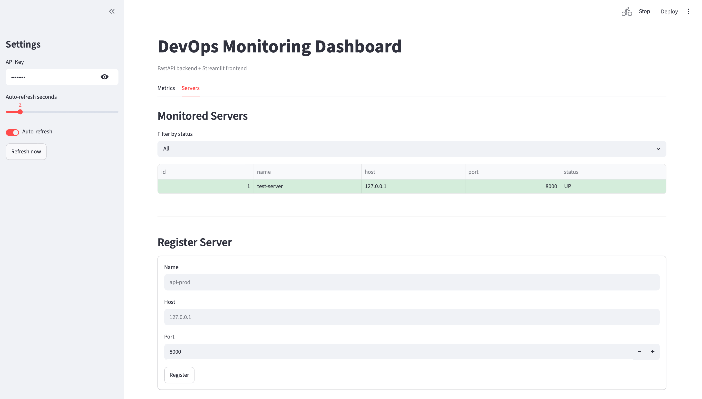
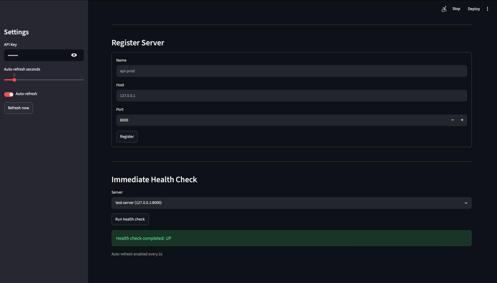
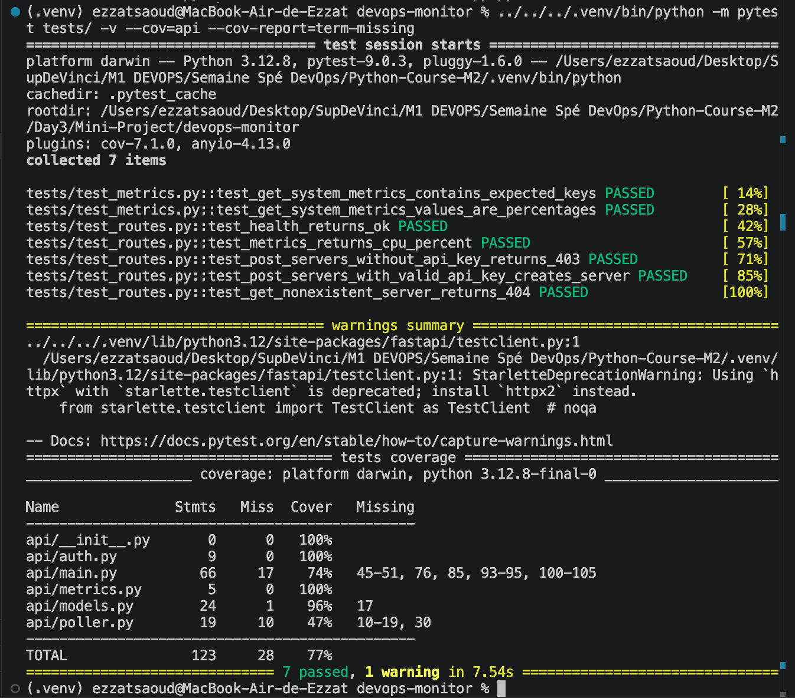

# DevOps Monitoring Dashboard

FastAPI + Streamlit monitoring dashboard built for the Day 3 mini-project.

The project exposes live system metrics, manages monitored servers, runs background health checks, and displays everything in a Streamlit dashboard.

## Features

- FastAPI backend with clean module structure
- Live system metrics from `psutil`
- WebSocket endpoint for real-time metrics
- API key protection for write endpoints
- In-memory server registry
- Background async health polling
- Streamlit dashboard with metrics, charts, server table, forms, and health checks
- Pytest test suite with coverage above 75%

## Screenshots

### Servers Dashboard



### Immediate Health Check



### Tests and Coverage



## Project Structure

```text
devops-monitor/
├── api/
│   ├── __init__.py
│   ├── main.py
│   ├── models.py
│   ├── auth.py
│   ├── metrics.py
│   └── poller.py
├── dashboard/
│   └── app.py
├── tests/
│   ├── test_metrics.py
│   └── test_routes.py
├── assets/
│   ├── servers-dashboard.png
│   ├── health-check.png
│   └── tests-coverage.png
├── requirements.txt
└── README.md
```

## Requirements

- Python 3.12+
- `pip`

## Local Setup

Create and activate a virtual environment:

```bash
python3 -m venv .venv
source .venv/bin/activate
```

Install dependencies:

```bash
pip install -r requirements.txt
```

Optional Makefile setup:

```bash
cp .env.example .env
make init
```

## Run the API

From the project root:

```bash
uvicorn api.main:app --reload --port 8000
```

Or with the Makefile:

```bash
make run
```

Open Swagger UI:

```text
http://127.0.0.1:8000/docs
```

Test the API:

```bash
curl http://127.0.0.1:8000/health
curl http://127.0.0.1:8000/metrics
```

## API Key

Protected endpoints require:

```text
X-API-Key: demo-key
```

You can override the local key with:

```bash
export API_KEY="your-secret-key"
```

## Useful API Commands

Create a server:

```bash
curl -X POST http://127.0.0.1:8000/servers \
  -H "Content-Type: application/json" \
  -H "X-API-Key: demo-key" \
  -d '{"name":"api-prod","host":"127.0.0.1","port":8000}'
```

List servers:

```bash
curl http://127.0.0.1:8000/servers
```

Run an immediate health check:

```bash
curl -X POST http://127.0.0.1:8000/servers/1/check
```

## Run the Streamlit Dashboard

Keep the API running in one terminal, then open a second terminal:

```bash
streamlit run dashboard/app.py
```

Open:

```text
http://localhost:8501
```

## Run Tests

```bash
pytest tests/ -v --cov=api --cov-report=term-missing
```

Or with the Makefile:

```bash
make test
```

Current local result:

```text
7 passed
Coverage: 77%
```

## Makefile Commands

```bash
make help
make init
make run
make build
make test
make test-api
make run-container
make stop
make clean
```

## Endpoints

| Method | Path | Auth | Description |
|---|---|---|---|
| GET | `/health` | Public | Health check |
| GET | `/metrics` | Public | System metrics |
| WebSocket | `/ws/metrics` | Public | Real-time metrics stream |
| GET | `/servers` | Public | List servers, optional `?status=UP` |
| GET | `/servers/{id}` | Public | Get one server |
| POST | `/servers` | API key | Register a server |
| DELETE | `/servers/{id}` | API key | Delete a server |
| POST | `/servers/{id}/check` | Public | Trigger one health check |
